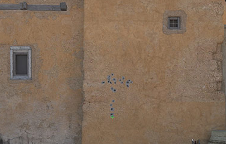
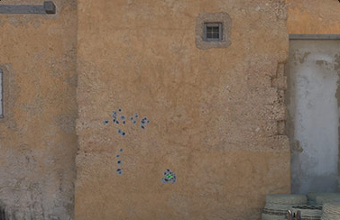

# 🎯 CS2 Logitech No Recoil


> **Dominate CS2 with precision!** This Logitech G Hub macro script provides **no-recoil functionality** for M4A4, M4A1-S, and AK-47, enhancing your aim while keeping things smooth and effortless. 🏆

---

## 📜 Table of Contents
- [🎥 Before & After Comparison](#-before--after-comparison)
- [✨ Features](#-features)
- [⚙️ Requirements](#-requirements)
- [🚀 Installation & Setup](#-installation--setup)
  - [1️⃣ Install Logitech G Hub](#1️⃣-install-logitech-g-hub)
  - [2️⃣ Prepare the Lua Script](#2️⃣-prepare-the-lua-script)
  - [3️⃣ Configure Logitech G Hub](#3️⃣-configure-logitech-g-hub)
  - [4️⃣ Customize Key Bindings](#4️⃣-customize-key-bindings)
  - [5️⃣ Test the Setup](#5️⃣-test-the-setup)
- [🎨 Customization Guide](#-customization-guide)
  - [🎛️ Dynamic Sensitivity Adjustment](#-dynamic-sensitivity-adjustment)
- [🛠️ Troubleshooting](#-troubleshooting)
- [🔍 Common Fixes](#-common-fixes)
- [📜 License](#-license)

---

## 🎥 Before & After Comparison

See the difference this script makes! 👇

<div align="center">
   
  
</div>

*Left: Without Script ❌ | Right: With Script ✅*

---

## ✨ Features

✔️ **No recoil** for M4A4, M4A1-S, and AK-47  
✔️ **Logitech G Hub compatibility** (G-Series Mice)  
✔️ **Toggleable recoil compensation** 🎭  
✔️ **Precise fractional movement** for improved accuracy 🎯  
✔️ **Customizable key bindings** 🔧  

> 📝 **Note:** This script was created and optimized for **1.5 in-game sensitivity**. If you use a different sensitivity, adjustments may be required.

---

## 🎨 Customization Guide

🔧 **Adjusting Sensitivity Compensation**
- The script is optimized for **1.5 in-game sensitivity**.
- If using a different sensitivity, adjust the `mult` variable:

```lua
local mult = 1.33 -- Default multiplier for recoil compensation
```
- Lower values = **Less recoil compensation** 🔽
- Higher values = **More recoil compensation** 🔼

🖱️ **Changing Mouse Buttons**
- If you want to assign different keys for activation, modify:

```lua
local M4A4 = 4  -- Change this to your preferred button
local AK47 = 5  -- Change this to your preferred button
local M4A1s = 6 -- Change this to your preferred button
```
- Find button IDs in Logitech G Hub's key assignment menu.

🎛️ **Dynamic Sensitivity Adjustment**
- Instead of manually changing values, you can **increase or decrease recoil compensation while playing**.
- Assign **G8** and **G9** buttons to **fine-tune recoil strength** dynamically:

```lua
if (event == "G_PRESSED" and arg == 8) then -- Press G8 to increase recoil comp
    mult = mult + 0.05
    OutputLogMessage("Increased Recoil Compensation: " .. mult .. "\n")
end
if (event == "G_PRESSED" and arg == 9) then -- Press G9 to decrease recoil comp
    mult = mult - 0.05
    OutputLogMessage("Decreased Recoil Compensation: " .. mult .. "\n")
end
```
- This lets you **test different sensitivities instantly** without restarting the script!

---

## 🔍 Common Fixes

🛠 **Script Not Working?**
- Ensure **Logitech G Hub** is installed and running.
- Make sure **Lua scripting** is enabled in Logitech G Hub.
- Assign the script to the **correct CS2 profile**.
- Try running **G Hub as administrator**.

⚡ **Recoil Feels Off?**
- Adjust the `mult` variable in the script for fine-tuning:
  ```lua
  local mult = 1.33 -- Increase or decrease this value for recoil control
  ```
- Ensure your **in-game sensitivity** matches the recommended settings (1.5 default).
- Test different **mouse DPI settings**.

🎮 **Script Not Triggering?**
- Verify that the **assigned mouse button** is correct:
  ```lua
  local M4A4 = 4  -- Change this to your preferred button
  ```
- Check if your **mouse software (e.g., G Hub) is up to date**.
- Make sure no **other macros are interfering**.

🔄 **Logitech G Hub Not Detecting Script?**
- Restart **Logitech G Hub**.
- Reinstall **Logitech G Hub** if the issue persists.
- Delete and **re-import the script**.

---

## 📜 License

🆓 **Open-source & free to use** – Provided as-is without warranties. Use responsibly!

---

💡 **Enjoy enhanced aim and recoil control in CS2!** 🎯🔥


